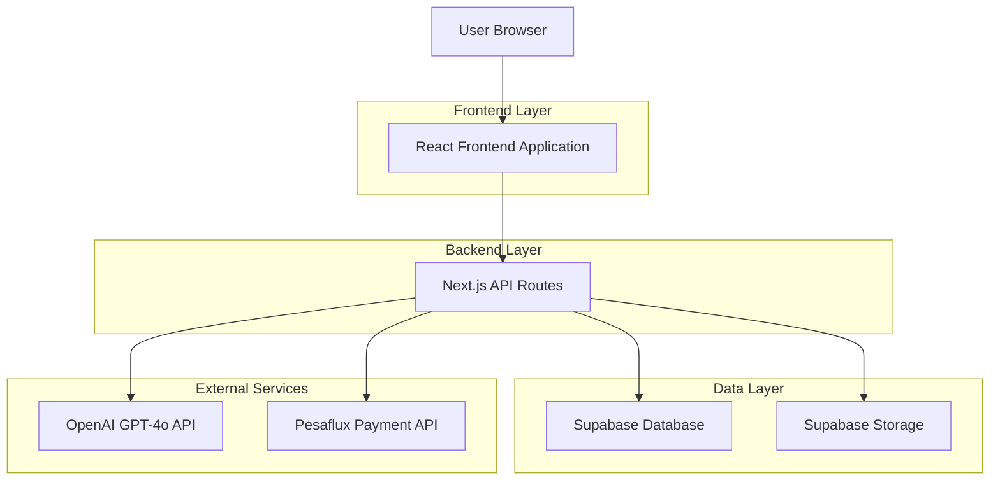
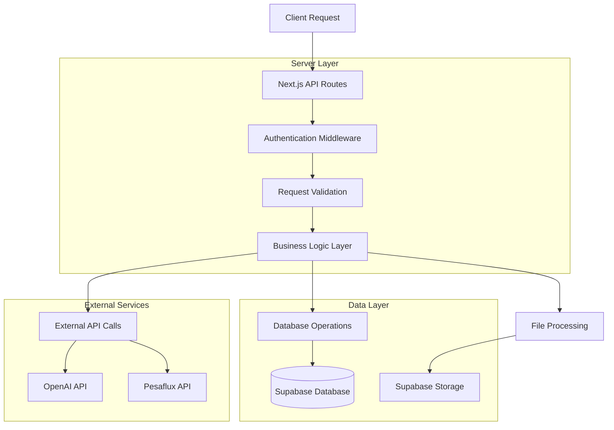

# SciDraft - Technical Architecture Document

## 1. Architecture Design



## 2. Technology Description

* Frontend: React\@18 + TypeScript + Tailwind CSS\@3 + Vite

* Backend: Next.js\@14 API routes + Node.js workers

* Database: Supabase (PostgreSQL)

* Storage: Supabase Storage

* Authentication: Supabase Auth

* File Processing: PDF.js + Tesseract.js

* Export Generation: Puppeteer + docx.js

* Charts: Recharts

* Icons: Lucide React

## 3. Route Definitions

| Route                 | Purpose                                              |
| --------------------- | ---------------------------------------------------- |
| /                     | Landing page with hero section and value proposition |
| /auth/login           | User authentication login form                       |
| /auth/signup          | User registration form                               |
| /dashboard            | Student dashboard with reports list                  |
| /reports/new          | Multi-step report creation wizard                    |
| /reports/\[id]        | Individual report viewer and editor                  |
| /reports/\[id]/export | Report export processing page                        |
| /admin                | Admin dashboard with system metrics                  |
| /admin/users          | User management interface                            |
| /admin/reports        | Report monitoring and management                     |
| /admin/payments       | Payment tracking and revenue analytics               |
| /admin/feedback       | User feedback and ratings management                 |
| /admin/prompts        | AI prompt configuration and versioning               |
| /admin/system         | System health monitoring and settings                |

## 4. API Definitions

### 4.1 Core API

**Authentication**

```
POST /api/auth/login
```

Request:

| Param Name | Param Type | isRequired | Description        |
| ---------- | ---------- | ---------- | ------------------ |
| email      | string     | true       | User email address |
| password   | string     | true       | User password      |

Response:

| Param Name | Param Type | Description            |
| ---------- | ---------- | ---------------------- |
| user       | object     | User profile data      |
| session    | object     | Authentication session |

**Manual Upload and Processing**

```
POST /api/manuals/upload
```

Request:

| Param Name | Param Type | isRequired | Description                         |
| ---------- | ---------- | ---------- | ----------------------------------- |
| file       | File       | true       | PDF/DOCX/IMG file                   |
| subject    | string     | true       | Subject (Biology/Chemistry/Physics) |

Response:

| Param Name    | Param Type | Description           |
| ------------- | ---------- | --------------------- |
| extractedText | string     | Parsed manual content |
| templateId    | string     | Generated template ID |
| hash          | string     | File content hash     |

**Report Generation**

```
POST /api/reports/generate
```

Request:

| Param Name | Param Type | isRequired | Description                           |
| ---------- | ---------- | ---------- | ------------------------------------- |
| templateId | string     | true       | Manual template reference             |
| results    | object     | true       | Experimental results and observations |
| reportType | string     | true       | 'draft' or 'full'                     |

Response:

| Param Name | Param Type | Description               |
| ---------- | ---------- | ------------------------- |
| reportId   | string     | Generated report ID       |
| sections   | object     | Report content by section |
| status     | string     | Generation status         |

**Payment Processing**

```
POST /api/payments/initiate
```

Request:

| Param Name  | Param Type | isRequired | Description           |
| ----------- | ---------- | ---------- | --------------------- |
| reportId    | string     | true       | Report to unlock      |
| amount      | number     | true       | Payment amount in KSH |
| phoneNumber | string     | true       | M-Pesa phone number   |

Response:

| Param Name  | Param Type | Description            |
| ----------- | ---------- | ---------------------- |
| paymentId   | string     | Payment transaction ID |
| checkoutUrl | string     | M-Pesa checkout URL    |

**Export Generation**

```
POST /api/reports/[id]/export
```

Request:

| Param Name | Param Type | isRequired | Description                                |
| ---------- | ---------- | ---------- | ------------------------------------------ |
| format     | string     | true       | 'pdf' or 'docx'                            |
| watermark  | boolean    | false      | Include watermark (default: true for free) |

Response:

| Param Name  | Param Type | Description                  |
| ----------- | ---------- | ---------------------------- |
| downloadUrl | string     | Signed URL for file download |
| expiresAt   | string     | URL expiration timestamp     |

## 5. Server Architecture Diagram



